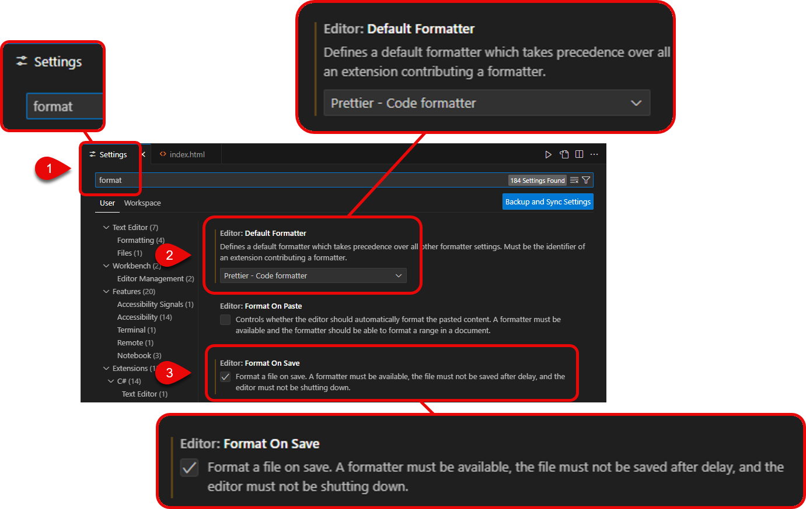

# Getting Started

## 1. VS Code Extensions

Install the recommended VS Code extensions when you first load the project. If you don't see this window (it will take a couple of seconds to appear), don't worry - it means you have already got the extensions installed.

See the screenshot below for help on which button to click to install these extensions.

## 2. VS Code preferences

1. Open VS Code's **Preferences** from the menu: _File > Preferences > Settings_
2. Type `format` in the search bar at the top
3. Select `Prettier - Code formatter` as your **Default Formatter**
4. Check the box next to **Editor: Format On Save**

See the screenshot below to help you with these options:

## 3. Tab spaces

1. With your VS Code **Preferences** window still open, type `tab` into the search bar at the top
2. In the **Editor: Tab Size** box, type `2`

See the screenshot below to help you with these options:

## 4. View HTML in browser

1. **Right-click** on `index.html` from the VS Code file browser on the left of your screen
2. Select **Open with Live Server** from the menu that appears
3. Wait a few seconds and you should see the page appear in your default web browser.\*

_\*If you don't see this option, check that you have installed all the recommended VS Code extensions from step 1 above._

It will look a mess at the moment, but don't worry. We'll soon fix that!

### 😎 Happy Coding! 😎
